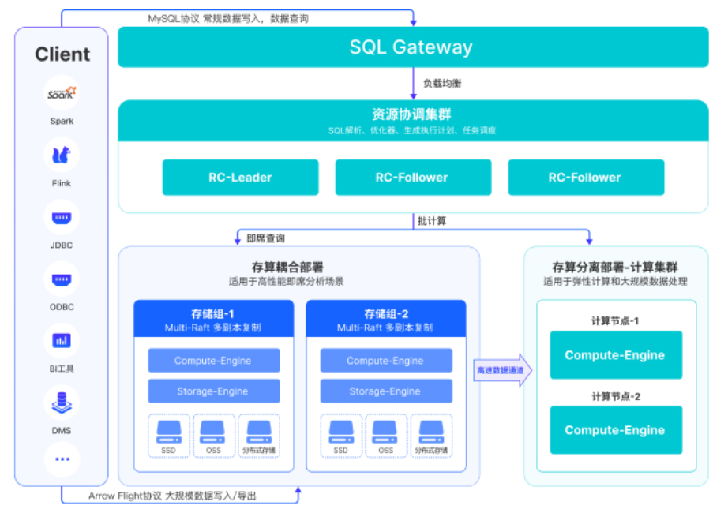

# Stonedata服务实例部署文档

## 概述

StoneData 是⼀款企业级全场景高性能数据仓库产品，融合数据库、大数据技术于一体。具备⽔平在线扩缩容，⾦融级⾼可⽤，兼容 MySQL⽣态，支持高吞吐的数据实时增删改、低延时的实时分析和复杂ETL，兼容上下游生态工具，提供全⾯向量化引擎、CBO优化器、多种数据源联邦查询等重要特性。StoneData 致⼒于在全场景 OLAP 业务上为⽤户提供统⼀的解决⽅案，适⽤于对性能、实时性、并发能⼒和灵活性有较⾼要求的场景

## 计费说明

计费方式包括：

- 按量付费（小时）
- 包年包月

目前提供如下实例：

| 规格族 | vCPU与内存 | 磁盘 |
| --- | --- | --- |
| 基础版 | ecs.g7.2xlarge，8vCPU 32GiB | ESSD云盘 250GiB |
| 进阶版 | ecs.r7.4xlarge，16vCPU 128GiB | ESSD云盘 500GiB |
| 高级版 | ecs.g7.8xlarge，32vCPU 128GiB | ESSD云盘 800GiB |

## 部署架构

## 部署流程

### 部署步骤

1.输入 服务实例名称 如:stone

2.选择 地域

3.选择 ECS交换机可用区

4.选择 现有VPC的实例ID

5.选择 网络交换机ID

6.选择 付费类型 如:按量付费,包年包月

7.输入 集群名称 如:my

8.输入 登录密码 (备注:Linux密码,stonedata数据库 root密码)

9.点击 下一步: 确认订单

### 验证结果

1.查看服务实例。服务实例创建成功后，部署时间大约需要10分钟。部署完成后，页面上可以看到对应的服务实例。
2.通过服务实例访问TuGraph。进入到对应的服务实例后，可以在页面上获取到web、rpc、ssh共3种使用方式。

3.进入 Linux 后, 却换到root(命令:sudo su -)

4.运行 yum install mysql

5.mysql -h(服务器IP) -P3001 -uroot -p密码[参照[部署步骤-->第8步]]

## 问题排查

请访问[Demo的问题排查链接](https://www.aliyun.com)获取帮助。

## 联系我们

欢迎访问Demo官网（[https://www.aliyun.com](https://www.aliyun.com)）了解更多信息。

联系邮箱：[https://www.aliyun.com](mailto:https://www.aliyun.com)

社区版开源地址：[https://github.com/](https://github.com/)